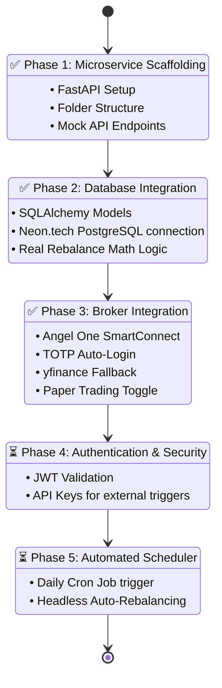

# ExecutionHub (Shannon's Demon Microservice)

ExecutionHub is a lightweight, high-performance FastAPI microservice designed to handle automated algorithmic trading strategies—specifically **Shannon's Demon** (Volatility Harvesting via Portfolio Rebalancing). 

It has been extracted from the monolithic backend into an independent service to ensure high scalability, isolation, and ease of deployment.

---

## 1. System Architecture

The microservice operates as the central engine between the user-facing frontend and the external brokerage APIs. It handles real-time pricing fallbacks, state persistence, and order execution.

```mermaid
graph TD
    %% Define Styles
    classDef client fill:#3b82f6,stroke:#1e3a8a,stroke-width:2px,color:#fff
    classDef cloud fill:#10b981,stroke:#047857,stroke-width:2px,color:#fff
    classDef db fill:#f59e0b,stroke:#b45309,stroke-width:2px,color:#fff
    classDef external fill:#8b5cf6,stroke:#4c1d95,stroke-width:2px,color:#fff

    %% Nodes
    UI[Frontend / Mobile App \n (React Native / Lovable)]:::client
    
    subgraph Render Cloud [Render.com - Web Service]
        API[ExecutionHub FastAPI \n (Uvicorn / Python 3.11)]:::cloud
        Logic[Shannon's Rebalance Engine]:::cloud
        BrokerSvc[Broker Service Router]:::cloud
    end

    DB[(Neon.tech PostgreSQL \n Tables: shannon_configs, \n shannon_trade_history)]:::db

    AngelOne[Angel One SmartAPI \n (Live LTP & Order Execution)]:::external
    YFinance[Yahoo Finance \n (Fallback Live LTP)]:::external

    %% Connections
    UI -- "REST (JSON) \n GET /portfolio, POST /deploy" --> API
    API --> Logic
    Logic -- "Read/Write State" --> DB
    Logic --> BrokerSvc
    
    BrokerSvc -- "1. Primary: Fetch LTP \n Place MARKET/LIMIT Orders" --> AngelOne
    BrokerSvc -. "2. Fallback: Fetch LTP \n (If Angel One fails/closed)" .-> YFinance
```

### Architecture Components:
*   **Frontend**: A modern UI (built via AI/Lovable) that communicates exclusively via REST endpoints.
*   **Cloud Hosting (Render)**: The FastAPI app is hosted as a Web Service on Render, automatically deploying on pushes to the GitHub repository.
*   **Database (Neon.tech)**: A serverless PostgreSQL database used for persisting strategy configurations (`shannon_configs`) and order logs (`shannon_trade_history`).
*   **Broker Engine**: Connects to **Angel One SmartAPI** via `pyotp` for automated TOTP generation. Includes a seamless fallback to **Yahoo Finance (`yfinance`)** for price feeds if the broker API is inaccessible.

---

## 2. Implementation Phases & Roadmap

The migration to this microservice architecture is executed in phases. The diagram below illustrates what has been successfully integrated and what remains for full production readiness.



### Pending Work for Live Deployment
While the application logic is complete, the following must be implemented before disabling `PAPER_TRADE` and executing with real capital:

1. **Phase 4 (Security):** Currently, the API endpoints (`/deploy`, `/rebalance`) do not verify who is calling them. We must implement JWT Middleware so that only authenticated users from the Frontend can trigger trades.
2. **Phase 5 (Automation):** The `/rebalance` endpoint currently requires a manual button click from the UI. To make Shannon's Demon truly passive, we need a daily Cron Job (via Render Background Workers or external tools like cron-job.org) to automatically hit the `/rebalance` endpoint right before market close.
